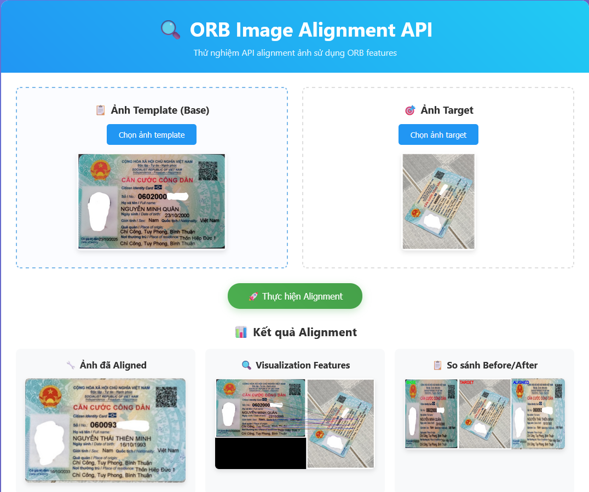

# 🔍 ORB Image Alignment API



## 📋 Tổng quan

ORB Image Alignment API là một dịch vụ web sử dụng thuật toán ORB (Oriented FAST and Rotated BRIEF) để thực hiện alignment ảnh. API này có thể căn chỉnh và khớp các đặc trưng giữa hai ảnh, hữu ích trong các ứng dụng computer vision như nhận dạng vật thể, theo dõi chuyển động, và xử lý ảnh.

## 🚀 Tính năng chính

- ✨ **ORB Feature Detection**: Phát hiện và mô tả đặc trưng ORB
- 🔄 **Image Alignment**: Căn chỉnh ảnh target theo ảnh template
- 📏 **Size Normalization**: Tự động chuẩn hóa kích thước ảnh
- 🎯 **Robust Homography**: Tính toán ma trận homography với RANSAC
- 📊 **Quality Assessment**: Đánh giá chất lượng alignment
- 🖼️ **Visualization**: Tạo ảnh minh họa các feature points và matches
- 🌐 **Web Interface**: Giao diện web đẹp để test API

## 📦 Cài đặt

### Yêu cầu hệ thống
- Python 3.8+
- OpenCV 4.x
- FastAPI
- SQLite (tùy chọn)

### Cài đặt dependencies

```bash
pip install -r requitement.txt
```

### Chạy ứng dụng

```bash
python main.py
```

API sẽ chạy tại: `http://localhost:5000`

## 🐳 Docker

### Build và chạy với Docker

```bash
# Build image
docker build -t orb-image-alignment-api .

# Chạy container
docker run -d -p 5000:5000 --name orb-api orb-image-alignment-api
```

### Sử dụng Docker Compose

```bash
docker-compose up -d
```

## 📚 Hướng dẫn sử dụng ORBImageAligner

### Khởi tạo

```python
from service.orb.ORBImageAligner import ORBImageAligner

# Khởi tạo với tham số mặc định
aligner = ORBImageAligner()

# Hoặc tùy chỉnh tham số
aligner = ORBImageAligner(
    target_dimension=800,  # Kích thước chuẩn để normalize
    orb_features=2000     # Số lượng ORB features tối đa
)
```

### Các tham số khởi tạo

| Tham số | Kiểu dữ liệu | Mặc định | Mô tả |
|---------|--------------|----------|-------|
| `target_dimension` | int | 800 | Kích thước chuẩn để normalize ảnh |
| `orb_features` | int | 2000 | Số lượng ORB features tối đa |

### Sử dụng cơ bản

```python
import cv2
from service.orb.ORBImageAligner import ORBImageAligner

# Khởi tạo aligner
aligner = ORBImageAligner(target_dimension=800, orb_features=2000)

# Đọc ảnh
base_img = cv2.imread('path/to/template.jpg')
target_img = cv2.imread('path/to/target.jpg')

# Thực hiện alignment
result = aligner.align(base_img, target_img)

# Kiểm tra kết quả
if result["success"]:
    print("✅ Alignment thành công!")
    
    # Lấy ảnh đã aligned
    aligned_image = result["aligned_image"]
    
    # Lưu kết quả
    cv2.imwrite('aligned_result.jpg', aligned_image)
    
    # In thống kê
    aligner.print_result_summary(result)
else:
    print(f"❌ Alignment thất bại: {result['error']}")
```

### Kết quả trả về

Hàm `align()` trả về một dictionary chứa:

```python
{
    "success": bool,                    # Trạng thái thành công
    "aligned_image": numpy.ndarray,     # Ảnh đã aligned
    "visualization_image": numpy.ndarray, # Ảnh minh họa features
    "comparison_image": numpy.ndarray,   # Ảnh so sánh before/after
    "base_image": numpy.ndarray,        # Ảnh base gốc
    "target_image": numpy.ndarray,      # Ảnh target gốc
    "original_sizes": {                 # Kích thước ảnh gốc
        "base": tuple,
        "target": tuple
    },
    "normalized_sizes": {               # Kích thước sau normalize
        "base": tuple,
        "target": tuple
    },
    "features": {                       # Số lượng features
        "base": int,
        "target": int
    },
    "good_matches": int,                # Số lượng good matches
    "inliers": int,                     # Số lượng inliers
    "inlier_ratio": float,              # Tỷ lệ inliers
    "quality_score": float,             # Điểm chất lượng (0-1)
    "homography_matrix": numpy.ndarray, # Ma trận homography
    "scales": {                         # Tỷ lệ scaling
        "base_scale": float,
        "target_scale": float
    }
}
```

### Ví dụ nâng cao

```python
import cv2
import numpy as np
from service.orb.ORBImageAligner import ORBImageAligner

def process_image_alignment(template_path, target_path):
    """
    Ví dụ xử lý alignment với error handling và optimization
    """
    
    # Khởi tạo aligner với tham số tối ưu
    aligner = ORBImageAligner(
        target_dimension=1000,  # Độ phân giải cao hơn
        orb_features=5000      # Nhiều features hơn
    )
    
    try:
        # Đọc ảnh với error handling
        base_img = cv2.imread(template_path)
        target_img = cv2.imread(target_path)
        
        if base_img is None or target_img is None:
            raise ValueError("Không thể đọc ảnh")
        
        print(f"📖 Đọc ảnh thành công:")
        print(f"  Template: {base_img.shape}")
        print(f"  Target: {target_img.shape}")
        
        # Thực hiện alignment
        print("🔍 Bắt đầu alignment...")
        result = aligner.align(base_img, target_img)
        
        if result["success"]:
            # Lưu các kết quả
            cv2.imwrite('output_aligned.jpg', result["aligned_image"])
            cv2.imwrite('output_visualization.jpg', result["visualization_image"])
            cv2.imwrite('output_comparison.jpg', result["comparison_image"])
            
            # In thông tin chi tiết
            aligner.print_result_summary(result)
            
            # Phân tích chất lượng
            quality = result["quality_score"]
            if quality > 0.8:
                print("🌟 Alignment chất lượng rất cao!")
            elif quality > 0.6:
                print("✅ Alignment chất lượng tốt")
            elif quality > 0.4:
                print("⚠️ Alignment chất lượng trung bình")
            else:
                print("❌ Alignment chất lượng thấp")
            
            return result
            
        else:
            print(f"❌ Alignment thất bại: {result['error']}")
            return None
            
    except Exception as e:
        print(f"💥 Lỗi: {str(e)}")
        return None

# Sử dụng
if __name__ == "__main__":
    result = process_image_alignment(
        template_path="template.jpg",
        target_path="target.jpg"
    )
```

### Tối ưu hóa tham số

#### Cho ảnh có độ phân giải cao
```python
aligner = ORBImageAligner(
    target_dimension=1200,  # Tăng resolution
    orb_features=5000      # Nhiều features hơn
)
```

#### Cho ảnh có độ phân giải thấp
```python
aligner = ORBImageAligner(
    target_dimension=600,   # Giảm resolution
    orb_features=1000      # Ít features hơn
)
```

#### Cho ảnh có nhiều chi tiết
```python
aligner = ORBImageAligner(
    target_dimension=1000,
    orb_features=3000      # Tăng features để bắt nhiều chi tiết
)
```

### Xử lý lỗi thường gặp

#### 1. Không đủ features
```python
result = aligner.align(base_img, target_img)
if not result["success"] and "features" in result["error"]:
    # Thử giảm threshold hoặc tăng số features
    aligner = ORBImageAligner(orb_features=3000)
    result = aligner.align(base_img, target_img)
```

#### 2. Ảnh quá khác biệt
```python
if not result["success"] and "homography" in result["error"]:
    print("Ảnh có thể quá khác biệt về góc nhìn hoặc nội dung")
    # Thử preprocessing ảnh trước
```

#### 3. Chất lượng thấp
```python
if result["success"] and result["quality_score"] < 0.3:
    print("Cảnh báo: Kết quả alignment có chất lượng thấp")
    print(f"Inlier ratio: {result['inlier_ratio']:.2%}")
    print(f"Good matches: {result['good_matches']}")
```

## 🔧 API Endpoints

### POST `/api/orb`
Thực hiện ORB alignment giữa hai ảnh

**Request:**
- `image_template`: File ảnh template
- `image_target`: File ảnh target

**Response:**
```json
{
    "success": true,
    "aligned_image_base64": "base64_string",
    "visualization_image_base64": "base64_string",
    "comparison_image_base64": "base64_string",
    "quality_score": 0.85,
    "inlier_ratio": 0.75,
    "features": {"base": 1500, "target": 1200},
    "good_matches": 300,
    "inliers": 225
}
```

### GET `/api/status`
Kiểm tra trạng thái API

## 🎨 Web Interface

Truy cập `http://localhost:5000` để sử dụng giao diện web với các tính năng:

- 📤 Upload ảnh template và target
- 🖼️ Preview ảnh trước khi xử lý
- 📊 Hiển thị kết quả alignment với thống kê chi tiết
- 💫 Giao diện đẹp, responsive trên mọi thiết bị

## ⚡ Performance Tips

1. **Tối ưu kích thước ảnh**: Sử dụng `target_dimension` phù hợp với ứng dụng
2. **Cân bằng features**: Nhiều features = chính xác hơn nhưng chậm hơn
3. **Preprocessing**: Enhance contrast và giảm noise trước khi alignment
4. **Memory management**: Xử lý ảnh lớn theo batch để tránh out of memory

## 🐛 Troubleshooting

### Lỗi import OpenCV
```bash
pip install opencv-python-headless
```

### Lỗi memory với ảnh lớn
Giảm `target_dimension` hoặc resize ảnh trước khi xử lý

### Alignment không chính xác
- Kiểm tra chất lượng ảnh input
- Tăng số lượng ORB features
- Đảm bảo ảnh có đủ texture và chi tiết

## 📄 License


## 🤝 Contributing

Mọi đóng góp đều được chào đón! Vui lòng tạo issue hoặc pull request.

## 📞 Support

Nếu gặp vấn đề, vui lòng tạo issue trên GitHub repository.